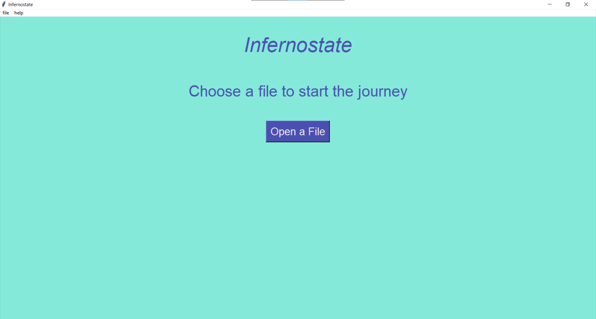
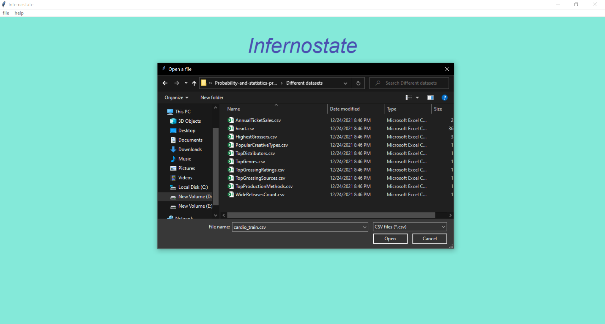
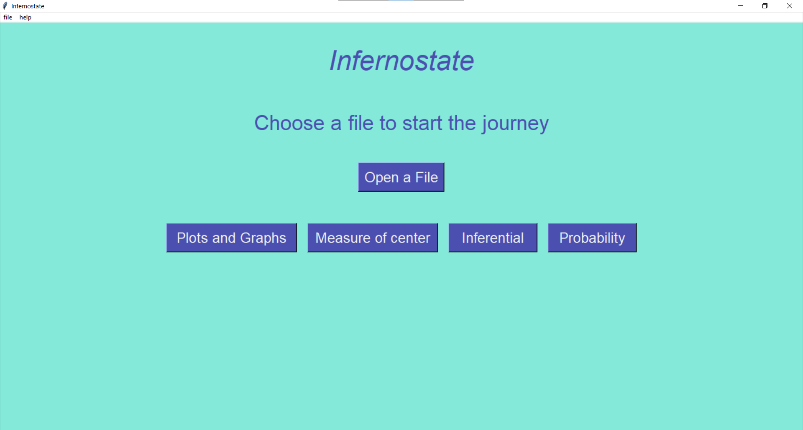
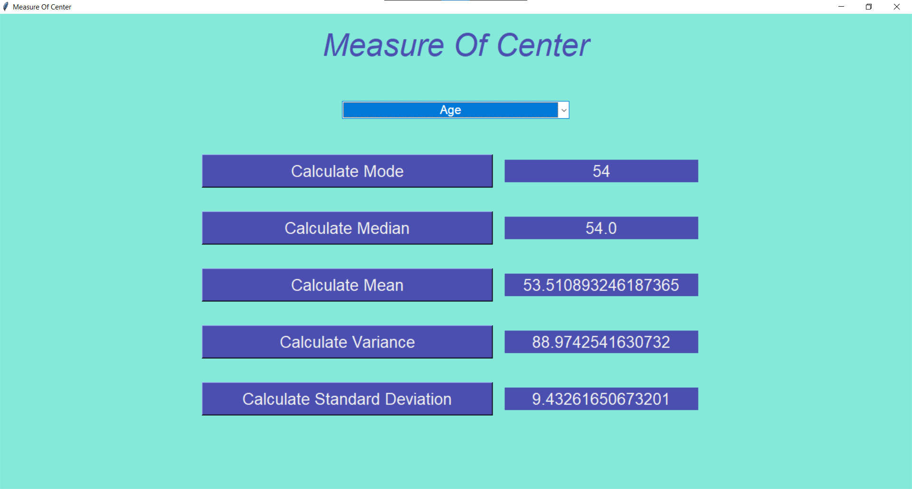
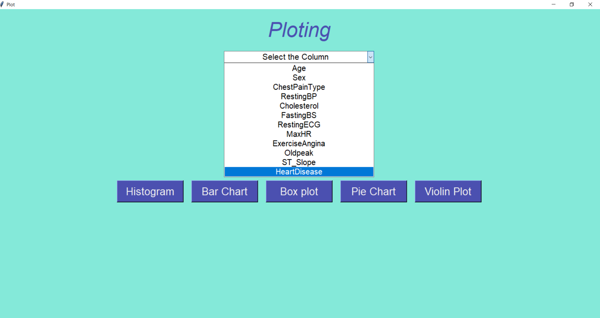
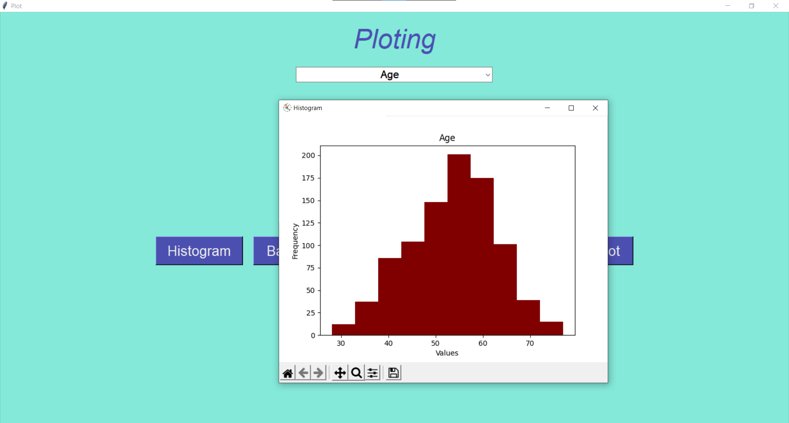
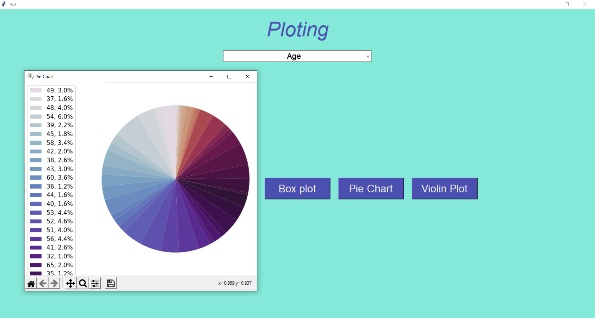
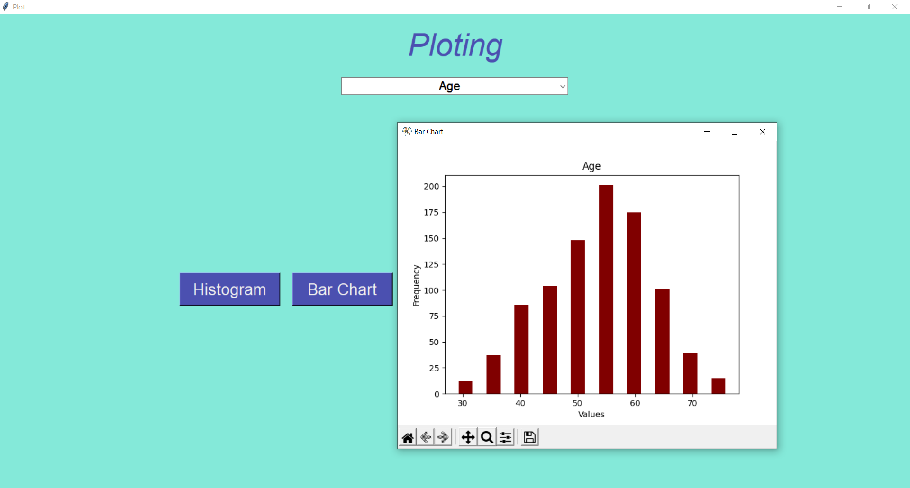
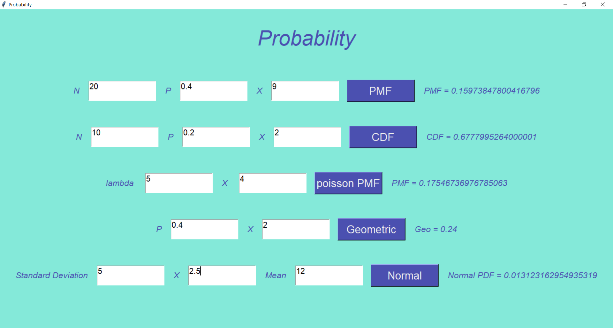

# Infernostate

<div align="center">

[](https://github.com/Abd-ELrahmanHamza/Infernostate/contributors)
[](https://github.com/Abd-ELrahmanHamza/Infernostate/issues)
[](https://github.com/Abd-ELrahmanHamza/Infernostate/blob/master/LICENSE)
[](https://github.com/Abd-ELrahmanHamza/Infernostate/network)
[](https://github.com/Abd-ELrahmanHamza/Infernostate/stargazers)
[](https://github.com/Abd-ELrahmanHamza/Infernostate)

</div>

## Table of contents

- [About the project](#about-the-project)
- [Getting Started](#getting-started)
- [Screenshots](#screenshots)
- [Contributors](#contributors)
- [License](#license)

## About the project

> Inferno State is a statistical tool that is used to plot data, calculate measures of center, PDF, and CDF of some known distributions.

> Run using executable file main.exe or window.py in start_window directory


## Getting Started

1. **Clone the project**
```
git clone https://github.com/Abd-ELrahmanHamza/Infernostate
```
2. **Install dependencies**
```
pip install pandas
pip install numby
pip install scipy
pip install statistics
```


## Screenshots












## Contributors

<table>
  <tr>

<td align="center">
<a href="https://github.com/Abd-ELrahmanHamza" target="_black">
<br /><sub><b>Abdelrahman Hamza</b></sub></a><br />
</td>

<td align="center">
<a href="https://github.com/ZeyadTarekk"  target="_black">
<br /><sub><b>Zeyad Tarek</b></sub></a><br />
</td>

<td align="center">
<a href="https://github.com/ZiadSheriif" target="_black">
<br /><sub><b>Ziad Sherif</b></sub></a><br />
</td>
<td align="center">
<a href="https://github.com/asmaaadel0" target="_black">
<br /><sub><b>Asmaa Adel</b></sub></a><br />
</td>  
</tr>
 </table>

## License

> This software is licensed under MIT License, See License for more information
